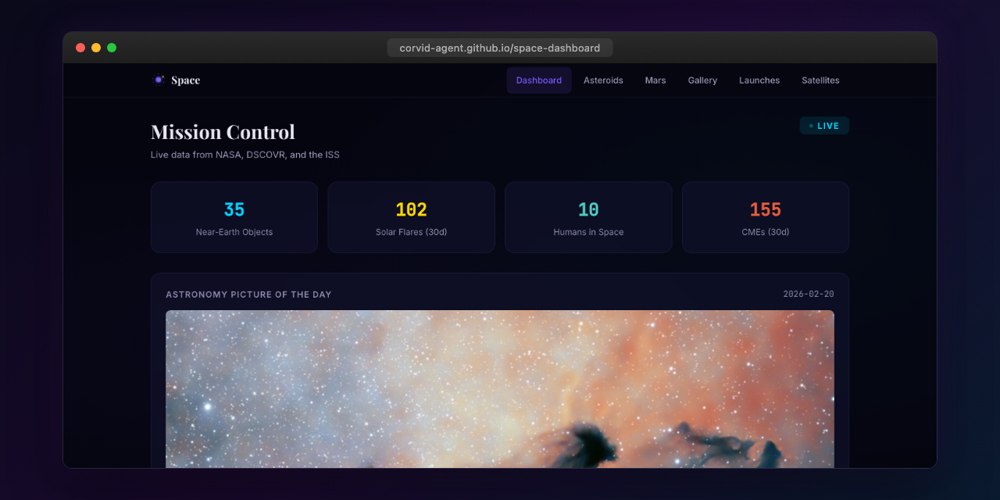

<p align="center"></p>

# Space Dashboard

Real-time space data dashboard featuring NASA Astronomy Picture of the Day, near-Earth asteroid tracking, Mars rover imagery, ISS location, and a NASA photo gallery.

**Live:** [corvid-agent.github.io/space-dashboard](https://corvid-agent.github.io/space-dashboard/)

## Features

- NASA Astronomy Picture of the Day (APOD)
- Near-Earth Object (NEO) asteroid tracking with hazard indicators
- Mars rover photos from Curiosity, Opportunity, and Spirit
- NASA image gallery search
- ISS real-time location tracking
- Space-themed UI with star field background
- Responsive layout with mobile bottom navigation

## Tech Stack

- Angular 21 (standalone components, signals, OnPush)
- NASA Open APIs (APOD, NEO, Mars Rover Photos, Image Library)
- Open Notify API (ISS position)
- TypeScript strict mode
- CSS custom properties with space-themed purple/nebula palette

## Development

```bash
npm install
npm start
npm test
npm run build
```

## License

MIT
